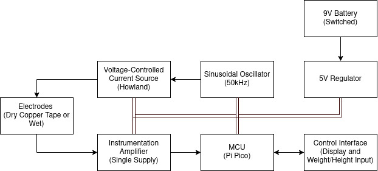

# Bioimpedance Sensor

Final Project for BYU ECEn 412: Biomedical Instrumentation

Co-Creators: Ben Broce (@benbroce), Jacob McCoy (@jhmccoy9), Trevor Reay (@tdr42)

## Theory

This device is a Single-Frequency Bioimpedance Analysis (SF-BIA) instrument. SF-BIA is the measurement of impedances in body tissue, and is used as a factor in body composition and respiratory rate measurements. It typically works by sending a small-amplitude current-source signal through body tissue, measuring the resulting potential between electrode sites, and calculating the impedance using Ohm’s law (Amini et al.). Our goal is to build a portable, battery-powered device allowing us to conveniently measure the bioimpedance of an individual via dry electrodes. Based on this bioimpedance, we will attempt to calculate body metrics including lean mass, fat mass, and total body water, using mathematical models from biomedical research (Pawar et al.).

### References
BIA Techniques

* Amini, M., Hisdal, J., & Kalvøy, H. (2018). Applications of bioimpedance measurement techniques in tissue engineering. Journal of Electrical Bioimpedance, 1, 142–158. https://doi.org/10.2478/joeb-2018-0019

Body Characteristic Equations Using BIA

* Pawar, A. A., Kamat, D. K., & Patil, P. M. (2017). Body composition analysis using various anthropometric equations. 2017 International Conference on Energy, Communication, Data Analytics and Soft Computing (ICECDS). https://doi.org/10.1109/icecds.2017.8390040

## Architecture

## Bill of Materials

| **Component** | **Part Link** | **Cost** |
|---|---|---|
| Microcontroller | [Raspberry Pi Pico](https://www.raspberrypi.com/products/raspberry-pi-pico/) | $4.00 |
| I2C OLED Display | --- | $1.99 |
| Copper Tape | --- | <$1.00 |
| Instrumentation Amplifier | --- | $--- |
| Dual or Quad Op-Amp (for Oscillator and Current Source) | --- | $--- |
| 9V Battery with Switched Box | --- | $--- |
| 5V Voltage Regulator | --- | $---|
| Misc Passives | --- | $---|
| Custom PCB | --- | $--- |
| **Total** | **---** | **$---** |

## Analog Circuit Design

The sinusoidal oscillator creates a 50kHz sinusoidal signal, which drives a Howland voltage-controlled current source to generate the excitation signal across the electrodes. The potential across the same electrodes is conditioned using a single-supply instrumentation amplifier and some analog filters, then read into the ADC of a microcontroller (an RP2040 on a Raspberry Pi Pico).

## Digital Circuit Design

The microcontroller has a user interface for entering biometric equation parameters like weight and height and displaying impedance and body metrics (potentiometers and an OLED display).

## Code and DSP

The code samples the input for a set sample time, applies a discrete-time digital bandpass filter to isolate the excitation signal response, performs an analysis for peak-to-peak measured voltage, and performs the calculations necessary to obtain a measured impedance and biometrics.
